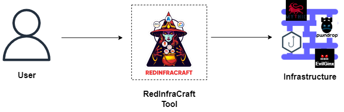
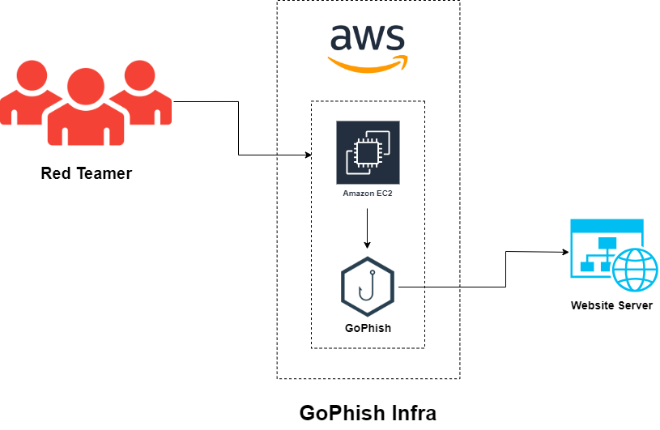
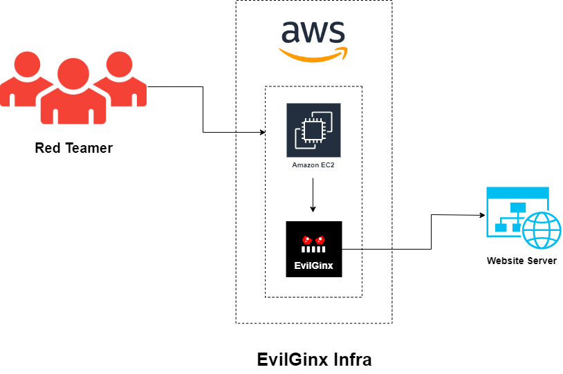
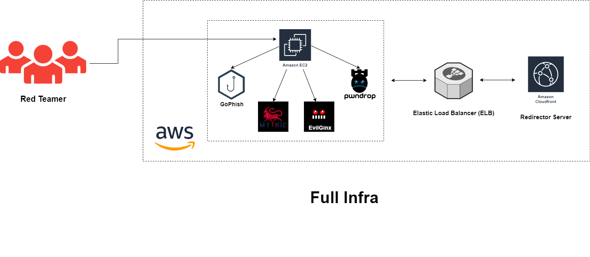
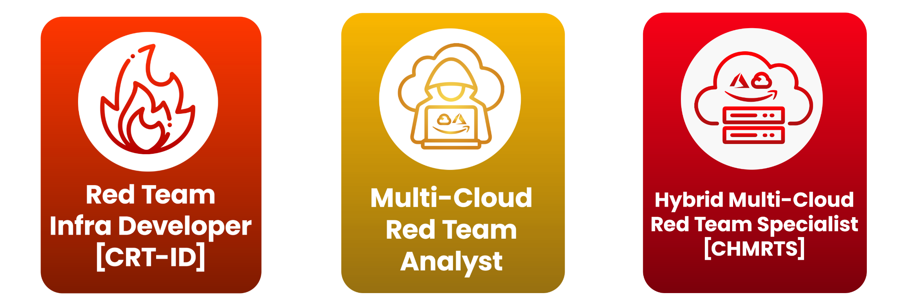

<div align="center">
  
</div>

# Red-Infra-Craft

Welcome to the **RedInfraCraft** Tool - your gateway to automating the deployment of robust red team infrastructures! RedInfraCraft is your trusted companion in effortlessly setting up and managing red team infrastructures, streamlining the process so you can focus on your mission. 

- Simplifies the deployment of Mythic Command and Control (C2) frameworks.
- Facilitates the creation and management of sophisticated phishing and payload setups
- Designed to be intuitive and easy to use, reducing the learning curve for red teamers.
- Provides thorough documentation and guides to assist users at every step.

Let's craft infrastructures together with **RedInfraCraft**!

## 1. Prerequisite

To follow this guide, you'll need to have the following software installed on your machine:

- **Terraform**

  To Download Terraform, you can visit their official website [HashiCorp](https://developer.hashicorp.com/terraform/tutorials/aws-get-started/install-cli). They     provide instructions on how to install Terraform on Windows, Linux, and macOS.

- **Python**

  Make sure you have [Python](https://www.python.org/) installed in your system.

## 2. RedInfraCraft Tool Installation
To acquire the tool, you need to clone this GitHub repository. Paste the below command in your terminal.

> [!IMPORTANT]
> Make sure you have installed [git](https://git-scm.com/downloads) in your machine

```bash
git clone https://github.com/RedTeamOperations/Red-Infra-Craft.git
```

## 3. How to spawn an Infrastructure?

RedInfraCraft enables you to deploy any infrastructure in a single step, automating your tasks efficiently.

<br>



### Available Infrastructures:

- **C2:**
  - Mythic C2 
  - Mythic C2 with CloudFront and Load Balancer
- **Payload:**
  - Pwndrop
- **Phishing:** 
  - EvilGinx
  - GoPhish
- **All in One Infra:** 
  - Mythic C2 with CloudFront and Load Balancer, Pwndrop, EvilGinx, GoPhish.

### Help Commands:

- To know more about this tool.
  ```bash
  redinfracraft.py info
  ```
  
- To know about arguments.
  ```bash
  redinfracraft.py --help
  ```
  
- To view available options.
  ```bash 
  redinfracraft.py help
  ```
  
### Commands to Spawn and Destroy Infras:

  | Infrastructure | Command | Description |
  | ------ | ------------ | ------ |
  | Mythic C2 | redinfracraft.py create c2 mythic | To Create Mythic C2 infrastructure. | 
  | Mythic C2 | redinfracraft.py destroy c2 mythic | To Destroy Mythic C2 infrastructure. | 
  | Mythic C2 | redinfracraft.py create c2 elb_c2 | To Create Mythic C2 with ELB & CloudFront infrastructure. | 
  | Mythic C2 | redinfracraft.py destroy c2 elb_c2 | To Destroy Mythic C2 with ELB & CloudFront infrastructure. | 
  | Payload | redinfracraft.py create payload pwndrop | To Create pwndrop payload infrastructure. | 
  | Payload | redinfracraft.py destroy payload pwndrop | To Destroy pwndrop payload infrastructure. |
  | Phishing | redinfracraft.py create phishing gophish | To Create Gophish phishing infrastructure. |
  | Phishing | redinfracraft.py destroy phishing gophish | To Destroy Gophish phishing infrastructure. |
  | Phishing | redinfracraft.py create phishing evilginx | To Create Evilginx phishing infrastructure. |
  | Phishing | redinfracraft.py destroy phishing evilginx | To Destroy Evilginx phishing infrastructure. |
  | All-in-one | redinfracraft.py create full_infra | To Create all infrastructures in one go (Mythic C2 with CloudFront and Load Balancer, Payload, Phishing). |
  | All-in-one | redinfracraft.py destroy full_infra | To Destroy all infrastructures in one go (Mythic C2 with CloudFront and Load Balancer, Payload, Phishing). |


## 4. Infrastructure Walkthroughs:

**Common steps required to perform for each infrastructure deployment.**

Upon executing command to spawn infra, you need to authenticate yourself and provide the following details:

- **var.access_key: AWS Access Key ID**
  
  You need to enter your AWS Management console Access Key ID here.
  
- **var.key_name**
  
  RedInfraCraft automates the retrieval of the secret PEM key file for your EC2 instances, ensuring a hassle-free experience. *To ensure uniqueness, you need to 
  provide different name each time*. Remembering the PEM file name is essential as you'll need it frequently throughout your operations.
  
- **var.secret_key: AWS Secret Access Key**
  
  You need to enter your AWS Management console Secret Access Key here.

You will see that your infra is deployed successfully. 

> [!NOTE]
> Once the command is successfuly executed, you'll find the secret file (with the given name) in the same folder were you have deployed the tool inside the 
  respective infra's directory. Now, you need to connect the EC2 instance.

1. **First limit the permissions of the secret file:**

```bash
chmod 400 YourSecretFileName
```

You can also do it manually as well by visiting properties of the secret file.

2. **Make an SSH connection with the machine:**

```bash
ssh -i "YourSecretFileName" machine_name
```

You can get this command from your AWS Management Console as well, remember you dont need to add `.pem` while entering *YourSecretFileName*


### 4.1 Mythic C2

<br>


<br>

- To Deploy this infra you need to execute following command:

  ```bash
  redinfracraft.py create c2 mythic
  ```

> [!NOTE]
> Perform Common necessary steps mentioned above

- After making the ssh connection with EC2 instance, Check for the “access” directory inside it, you will find Mythic, navigate into it:

  ```bash
  cd access/Mythic
  ```

- To get the credentials of Mythic, run the following command:

  ```bash
  cat .env
  ```

- If you encounter a *directory not found* error, you need to restart Mythic by running the following command:

  ```bash
  sudo ./mythic-cli start
  ```

- Open a different PowerShell window to make a localhost connection for Mythic:

  ```bash
  ssh -L 7443:127.0.0.1:7443 -i "YourSecretFileName" machine_name
  ```

- Now, you can open the .env file in the first powershell window to retrieve the credentials:

  ```bash
  cat .env
  ```

These steps will help you properly set up and connect to Mythic after provisioning the infrastructure.

Visit https://localhost:7443/new/login to access Mythic.

<br>

### 4.2 Mythic C2 with ELB & CloudFront

<br>


- To Deploy this infra you need to execute following command:

  ```bash
  redinfracraft.py create c2 elb_c2
  ```

> [!NOTE]
> Perform Common necessary steps mentioned above

- After making the ssh connection with EC2 instance, Check for the “access” directory inside it, You will find Mythic, navigate into it:

  ```bash
  cd access/Mythic
  ```

- To get the credentials of Mythic, run the following command:

  ```bash
  cat .env
  ```

- If you encounter a "directory not found" error, you need to restart Mythic by running the following command:

  ```bash
  sudo ./mythic-cli start
  ```

- Open a different PowerShell window to make a localhost connection for Mythic:

  ```bash
  ssh -L 7443:127.0.0.1:7443 -i "YourSecretFileName" machine_name
  ```

- Now, you can open the .env file to retrieve the credentials:

  ```bash
  cat .env
  ```

These steps will help you properly set up and connect to Mythic after provisioning the infrastructure.


**To Create Payload:**

After accessing Mythic, follow these steps to create a payload:

1. Visit "https://localhost:7443/new/login" to access Mythic.
2. Once logged in, navigate to the payload creation section.
3. In the "Domain" field, add the domain of the CloudFront distribution. You can obtain this domain from the management console of AWS.
4. Set the "Callback port" to 443.
5. Review your payload configuration.
6. You can view your payload details and download it for use. 

These steps will help you create a payload in Mythic with the appropriate domain and callback port settings for your CloudFront distribution.

### 4.3 Payload - Pwndrop

<br>


<br>

- To Deploy this infra you need to execute following command:

- ```bash
  redinfracraft.py create payload pwndrop
  ```
> [!NOTE] 
> Perform Common necessary steps mentioned above

- After making the ssh connection with EC2 instance, Check for the “pwndrop” directory, navigate into it:

  ```bash
  cd pwndrop
  ```

- To start the Pwndrop on your machine:

  ```bash
  sudo ./pwndrop
  ```

Visit https://<your_machine_ip>/pwndrop to access Pwndrop dashboard

These steps will help you properly set up and connect to pwndrop after provisioning the infrastructure.


### 4.4 Phishing - GoPhish

<br>



<br>

- To Deploy this infra you need to execute following command:

  ```bash
  redinfracraft.py create phishing gophish
  ```

> [!NOTE]
> Perform Common necessary steps mentioned above

- After making the ssh connection with EC2 instance, to start the GoPhish on your machine, you need to execute following command:

  ```bash
  sudo ./gophish
  ```
Visit https://<your_machine_ip>:3333 to access Gophish dashboard

  - Username (default): admin
  - Password (default): gophish

Now you can access all options of GoPhish.

These steps will help you properly set up and connect to GoPhish after provisioning the infrastructure.


### 4.5 Phishing - EvilGinx

<br>



<br>

- To Deploy this infra you need to execute following command:

  ```bash
  redinfracraft.py create phishing evilginx
  ```

> [!NOTE]
> Perform Common necessary steps mentioned above

- After making the ssh connection with EC2 instance, Check for the “evilginx2” directory, navigate into it:

  ```bash
  cd evilginx2
  ```

- To start the EvilGinx on your machine :

  ```bash
  sudo ~/evilginx2/evilginx2 -p ./phishlets/
  ```

These steps should help you properly set up and connect to EvilGinx after provisioning the infrastructure


### 4.6 All-in-one

<br>



- To Deploy this infra you need to execute following command:

  ```bash
  redinfracraft.py create full_infra
  ```

> [!NOTE]
> Perform Common necessary steps mentioned above**

This infrastructure offers you the flexibility to utilize every component. You must adhere to the specified steps for each respective component.

## Learning Content

If you want to learn more, please refer to this content:

<br>



- Red Team Infra Dev [[CRT-ID](https://cyberwarfare.live/product/red-team-infra-developer/)]
- Multi-Cloud Red Team Analyst [[MCRTA](https://cyberwarfare.live/product/multi-cloud-red-team-analyst-mcrta/)]
- Hybrid Multi-Cloud Red Team Specialist [[CHMRTS](https://cyberwarfare.live/product/hybrid-multi-cloud-red-team-specialist-chmrts/)]


## Future Releases
This is the initial version of our tool, currently hosted on the AWS cloud platform. We've laid the groundwork for this release, focusing on delivering robust and reliable services on AWS.

However, this is just the beginning.

In the near future, we plan to significantly expand the tool's capabilities.
Our roadmap includes adding support for more frameworks, which will give users more options to meet their specific needs. This expansion will improve the tool's flexibility and usability, targeting a broader audience.

Additionally, we are working to make this tool available on other major cloud providers. Soon, users will be able to access this tool on Microsoft Azure and Google Cloud Platform (GCP). This multi-cloud support will ensure that our tool can integrate seamlessly into a variety of cloud environments, providing more choice and convenience to our users.
Stay tuned for these exciting updates as we continue to develop and improve our tools to better meet your needs.


## Your Feedback

We highly value your feedback, as it plays a crucial role in the continuous development of RedInfraCraft. Your suggestions and comments are invaluable in further enhancing the tool. Please don't hesitate to share your thoughts either by creating an Issue or reaching out to us via email at [info@cyberwarfare.live](mailto:info@cyberwarfare.live) with the subject **RedInfraCraft**.
