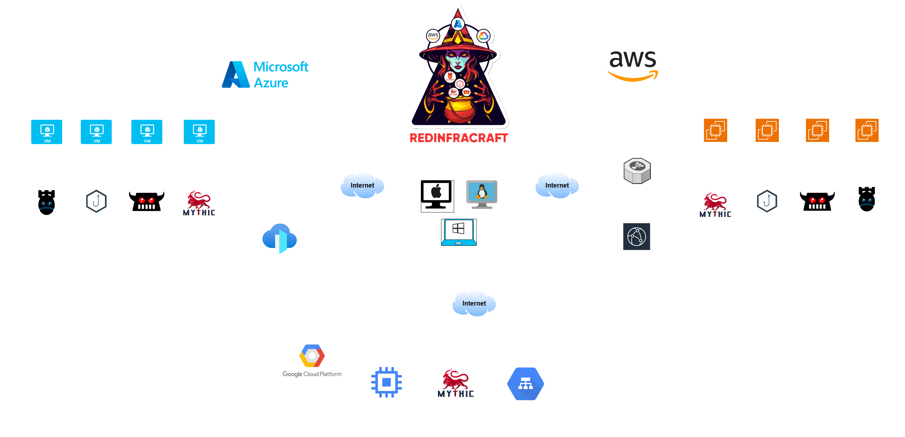

<div align="center">
<picture>
  <source media="(prefers-color-scheme: dark)" srcset="assets/RedinfraCraft_White.png">
  <source media="(prefers-color-scheme: light)" srcset="assets/RedInfraCraft_Black.png">
  
</picture>
</div>

# Red-Infra-Craft (V2)

Welcome to the **RedInfraCraft (V2)** Tool - your gateway to automating the deployment of robust red team infrastructures! RedInfraCraft is your trusted companion in effortlessly setting up and managing red team infrastructures, streamlining the process so you can focus on your mission. 

- Simplifies the deployment 🚀 of Mythic Command and Control (C2) frameworks. 
- Facilitates the creation 🎯 and management of sophisticated phishing and payload setups. 
- Designed 💡 to be intuitive and easy to use, reducing the learning curve for red teamers.  
- Provides thorough documentation 📚 and guides to assist users at every step.  
- Supports multi-cloud ☁️ environments, allowing deployments across different cloud providers with flexibility and ease.  

Let's craft infrastructures together with **RedInfraCraft (V2)**!!

<br>

## 1. Prerequisite

To follow this guide, you'll need to have the following software installed on your machine:

- **Terraform**

  To Download Terraform, you can visit their official website [HashiCorp](https://developer.hashicorp.com/terraform/tutorials/aws-get-started/install-cli). They     provide instructions on how to install Terraform on Windows, Linux, and macOS.

- **Python**

  Make sure you have [Python](https://www.python.org/) installed in your system.

- **Cloud Provider Access**

  You should have an active account and proper credentials/license for at least one of the following cloud providers:

  - Amazon Web Services (AWS)
  - Microsoft Azure
  - Google Cloud Platform (GCP)

  This guide assumes you have sufficient permissions to create and manage resources within your chosen cloud environment.
<br>

## 2. RedInfraCraft Tool Installation
To acquire the tool, you need to clone this GitHub repository. Paste the below command in your terminal.

> [!IMPORTANT]
> Make sure you have installed [git](https://git-scm.com/downloads) in your machine

```bash
git clone https://github.com/RedTeamOperations/Red-Infra-Craft.git
```
<br>

## 3. How to spawn an Infrastructure?

RedInfraCraft enables you to deploy any infrastructure in a single step, automating your tasks efficiently.

<br>

<div align="center">
  <picture>
    <source media="(prefers-color-scheme: dark)" srcset="assets/Common_user1.png">
    <source media="(prefers-color-scheme: light)" srcset="assets/Common_user.png">
    
  </picture>
</div>

### Available Infrastructures:

- **C2:**
  - Mythic C2 
  - Mythic C2 with CloudFront and Load Balancer (AWS)
  - Mythic C2 with Frontdoor and Load Balancer (Azure)
  - Mythic C2 with Application Load Balancer (GCP)
- **Payload:**
  - Pwndrop
- **Phishing:** 
  - EvilGinx
  - GoPhish
- **All in One Infra:** 
  - Mythic C2 with CloudFront and Load Balancer, Pwndrop, EvilGinx, GoPhish.
  - Mythic C2 with Frontdoor and Load Balancer, Pwndrop, EvilGinx, GoPhish.

### Cloud Providers
1) AWS
2) Azure
3) GCP

### Help Commands:

- To know more about this tool 💡
  ```bash
  redinfracraft.py info
  ```
  
- To know about arguments 💡
  ```bash
  redinfracraft.py --help
  ```
  
- To view available options 💡
  ```bash 
  redinfracraft.py help
  ```
  
### Commands to Spawn 🔧 and Destroy 🗑️ Infras:

Command Explanation:
  
  --> redinfracraft.py  action  cloud_provider  infra_type  infra
    
- redinfracraft.py  create       aws            c2      mythic
    
- redinfracraft.py  destroy      azure          c2      mythic
    
- redinfracraft.py  create       gcp            c2      mythic


For the step-by-step guide to spawn/destroy Infra go to [infra_deployment_guide](https://github.com/RedTeamOperations/Red-Infra-Craft/tree/main/infra_deployment_guide)

  | Infrastructure | Cloud Provider | Command | Description |
  | ------ | -- | ------------ | ------ |
  | Mythic C2 | AWS | redinfracraft.py create/destroy aws c2 mythic | To Create/destroy Mythic C2 infrastructure. | 
  | Mythic C2 | Azure | redinfracraft.py create/destroy azure c2 mythic | To Create/destroy Mythic C2 infrastructure. | 
  | Mythic C2 | AWS | redinfracraft.py create/destroy aws c2 mythic_lb | To Create/destroy Mythic C2 with ELB & CloudFront infrastructure. | 
  | Mythic C2 | Azure | redinfracraft.py create/destroy azure c2 mythic_lb | To Create/destroy Mythic C2 with ELB & Frontdoor infrastructure. | 
  | Mythic C2 | GCP | redinfracraft.py create/destroy gcp c2 mythic_lb | To Create/destroy Mythic C2 with ALB infrastructure. | 
  | Payload | AWS | redinfracraft.py create/destroy aws payload pwndrop | To Create/destroy pwndrop payload infrastructure. | 
  | Payload | Azure | redinfracraft.py create/destroy azure payload pwndrop | To Create/destroy pwndrop payload infrastructure. | 
  | Phishing | AWS | redinfracraft.py create/destroy aws phishing gophish | To Create/destroy Gophish phishing infrastructure. |
  | Phishing | Azure | redinfracraft.py create/destroy azure phishing gophish | To Create/destroy Gophish phishing infrastructure. |
  | Phishing | AWS | redinfracraft.py create/destroy aws phishing evilginx | To Create/destroy Evilginx phishing infrastructure. |
  | Phishing | Azure | redinfracraft.py create/destroy azure phishing evilginx | To Create/destroy Evilginx phishing infrastructure. |
  | All-in-one | AWS | redinfracraft.py create/destroy aws full_infra | To Create/destroy all infrastructures in one go (Mythic C2 with CloudFront and Load Balancer, Payload, Phishing). |
  | All-in-one | Azure | redinfracraft.py create/destroy azure full_infra | To Create/destroy all infrastructures in one go (Mythic C2 with Frontdoor and Load Balancer, Payload, Phishing). |

<br>

## 4. Cost & Specification Overview (Cloud Resources)

### 1. AWS 


  | Resources | Details |
  | ------ | ------------ |
  | EC2 Instance	 | t2.medium (2 vCPU, 4 GB RAM) - Ubuntu AMI: ami-080e1f13689e07408 |
  | Volume (Root Block Device)	 | 20 GB (gp2 EBS)|
  | Security Groups	 | 	1) "Terra_Ec2_sg: Allows SSH (22), HTTP (80) from ELB" 2) "terraElbSg: Allows HTTP (80)" |
  | Key Pair | RSA 4096-bit key pair generated via Terraform |
  | Application Load Balancer (ALB) | Internet-facing, HTTP only, with target group |
  | Target Group | HTTP on port 80, attached to EC2 instance |
  | CloudFront | CDN distribution pointing to the ALB |
  | VPC & Subnets | Using default VPC and multiple subnets |
  | Data sources used	 | 1) Public IP fetch (ipify), 2) AWS VPC, 3) Subnets in selected AZs |
  
Total Estimated Cost: $4.20/day  
* Actual CloudFront + data transfer may vary with usage and traffic  

### 2. Azure 

  | Resources | Details |
  | ------ | ------------ |
  | VM	 | Ubuntu 18.04, size: Standard_B1ms, SSH only, User: azureuser |
  | NIC | Connected to subnet & public IP: Dynamic IP, DNS label hardcoded |
  | NSG | Rules for HTTP, HTTPS (from AzureFrontDoor), SSH (from any) |
  | SSH Key	 | RSA 4096-bit key pair generated locally |
  | Frontdoor | Origin, Origin Group, Front Door Endpoint, Front Door Route |

Total Estimated Cost: $3.74/day  
* This assumes light/moderate usage, 1 VM, and no additional premium services (like WAF, Private Link, or DDoS Protectio, actual cost may vary

### 3. GCP

  | Resources | Details |
  | ------ | ------------ |
  | Compute Instance	 | Machine: n2-standard-2, OS: Debian 11, Public IP: Ephemeral, Scratch Disk: NVMe, Instance Group |
  | Firewall Rule | Allow: TCP 80 , Allow: TCP 443, Allow: TCP 80/443 Sources: GCP Health Check IP ranges |
  | Load Balancer | Global IP Address, Health Check, Frontend Service, Backend Service, URL Map, HTTP Proxy |

Total Estimated Cost: $5.6/day   
* actual cost may vary

<br>

## Learning Content

If you want to learn more, please refer to this content:


<div align="center">
<picture>
  <source media="(prefers-color-scheme: dark)" srcset="assets/Certification1.png">
  <source media="(prefers-color-scheme: light)" srcset="assets/Certifications.png">
  
</picture>
</div>

- Red Team Infra Dev [[CRT-ID](https://cyberwarfare.live/product/red-team-infra-developer/)]
- Multi-Cloud Red Team Analyst [[MCRTA](https://cyberwarfare.live/product/multi-cloud-red-team-analyst-mcrta/)]
- Hybrid Multi-Cloud Red Team Specialist [[CHMRTS](https://cyberwarfare.live/product/hybrid-multi-cloud-red-team-specialist-chmrts/)]

<br>

## Future Releases
Our tool now supports a multi-cloud environment, seamlessly operating across AWS, Microsoft Azure, and Google Cloud Platform (GCP). This broad support ensures maximum flexibility, allowing users to integrate the tool into their preferred cloud infrastructure with ease.

But we’re just getting started.

In upcoming releases, we plan to introduce new cloud-native architectures and additional Command and Control (C2) mechanisms across all supported platforms. These enhancements will further strengthen the tool's capabilities for cloud security operations, offering deeper insights and more powerful features for both offensive and defensive use cases.

Stay tuned as we continue to innovate and expand our tool to meet the evolving needs of the cloud security community.

<br>

## Your Feedback

We highly value your feedback, as it plays a crucial role in the continuous development of RedInfraCraft. Your suggestions and comments are invaluable in further enhancing the tool. Please don't hesitate to share your thoughts either by creating an Issue or reaching out to us via email at [info@cyberwarfare.live](mailto:info@cyberwarfare.live) with the subject **RedInfraCraft**.
